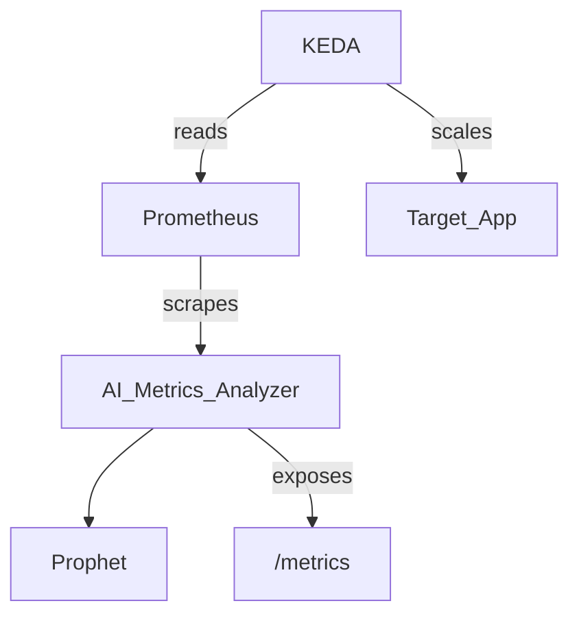

# AI/ML Project Demo - k8s-ai-autoscaling

## Contributor

**Name:** [Orkhan Mahmudzada]  
**Email/Slack:** [omahmudzada@mirantis.com]  

---

## Project Overview

### Project Name

[k8s-ai-autoscaling]

### Project Purpose

[AI-Based  Forecasting and Autoscaling with Prophet,Prometheus and KEDA.]

### Project Outcomes

- [Accurate Forecasting of Resource Usage]
- [Improved Autoscaling Strategy]
- [Scalable and Flexible Architecture]

---

## Technical Details

### Platform

- Runs on: **k0rdent**

### Repo

- Hosted at: [https://github.com/Mirantis/k8s-ai-autoscaling]

### Technical Overview

- Uses Facebook Prophet for time-series forecasting of resource metrics.
- Metrics collected via Prometheus from Kubernetes workloads.
- Forecasts exposed via a REST API, scraped by Prometheus using a ServiceMonitor.
- KEDA scales deployments based on forecasted metrics.
- Deployed via Helm, with support for namespace isolation and dependency management.

---

## Service Templates

### Service Templates Used

[KEDA]

### Service Templates Created Specifically for this Project

[ai-metric-analyzer-0.1.0]

---

## Documentation and Links

- 📄 [Design Document](https://docs.google.com/document/d/1Lqb9V_H4qL9cIsYtwFYV0i631BgHbPkRIBh2-mKVoJ4)
- 🎥 [Demo Video](https://drive.google.com/file/d/1_WsL7K0wGQhoxJciLo5Qd__TQgJILzcx/view)
- 📘 [GitHub Repo](https://github.com/Mirantis/k8s-ai-autoscaling)

---

## Artifacts

- [x] Docker Image: `python:3.10-slim`
- [x] Helm Chart: `ai-metrics-analyzer/` (under Mirantis repo)
- [x] Custom ServiceMonitor definition

---

